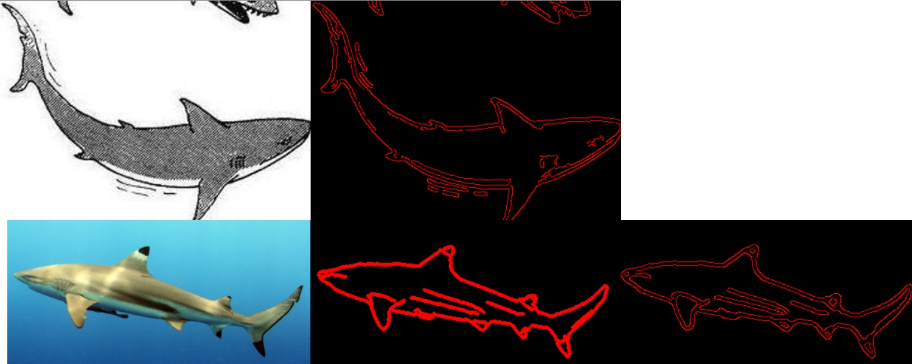

# Visual Domain
## Dataset

See DeepHumor_Dataset.pptx for information. 

Evtl. auf Duplikate hinweisen

Ca. 90% der Bilder sind im Hochformat und die restlichen im Querformat. Deswegen habe ich mich entschieden, dass die “Standardgröße” basierend der Bilder sind die im Hochformat sind und die Querformatigen skaliere (unter Berücksichtigung des Seitenverhältnisses + Padding) auf die richtige Größe. Dazu habe ich mir ein schnelles Skript geschrieben, welches die „durchschnittliche“ Größe der hochformatigen Bilder ermittelt (559x690). Ich weiß noch nicht ob ich die volle Größe nehmen werde oder zumindest mit halber Auflösung arbeiten werde.

## Baseline
accuracy reported on most frequent, random, average:

* Baseline Accuracy if random:	0.139410188
* Baseline Accuracy if average picked:	0.139410188
* Baseline Accuracy if most frequent is picked:	0.252010724
* Average absolute difference if random:	2.365951743
* Average absolute difference if average:	1.532171582
* Average absolute difference if most frequent	2.138069705

## Naive CNN
implement naive CNN with 2 conv+pool blocks and 1 fully connected layer.
(commit: bfa0790). "End2End", because based on images the resulting
funniness is directly predicted.

Implement similar CNN as regression. reasoning: being off by one should not be
considered as bad.

Sehr sehr viele Hyperparameterkombinationen (viele Layer, weniger Layer, viele Featuremaps, wenige Feature Maps, Learningrate, Weight Decay)

EMD Loss function https://arxiv.org/pdf/1611.05916.pdf
(Not fully explored).

Different cartoon sizes (*0.5 , * 0.25, * 1.0).
Edge Detection (Photoshop transformation)

Problem: Overfitting!!!

## Pretrained CNN
Using ResNet18 where the first 3 blocks were fixed (and the last) trainable.

26.94% accuracy (higher than baseline) for validation set. May be explainable by duplicates in dataset.

Preprocessing:

    def get_custom_transformation(self):
        return [
            transforms.RandomResizedCrop(224, scale=(0.08, 1.0), ratio=(0.75, 1.3333333333333333), interpolation=2),
            transforms.RandomRotation(16),
            transforms.RandomHorizontalFlip(),
            #transforms.Resize((224, 224)),
            transforms.ToTensor(),
            transforms.Normalize((0.5, 0.5, 0.5), (0.5, 0.5, 0.5)),
        ]

Solved problem of overfitting. But accuracy not much higher than baseline.

## "Other" Experiments
Use DCT transformation & spectogram

issue may be:
Dass die DCT nicht gut funktioniert, kann daran liegen, dass sie ein ganz bestimmtes Spektrum erzeugt, das die Varianz des Ausgangsmaterials in wenigen Koeffizienten am Anfang konzentriert, während die meisten Koeffizienten konstant bleiben. D.h. es quantifiziert die Daten stark. 

No improvement at all

## Transfer Learning of TU Berlin Dataset
Next idea: implement object detection to get a feature vector.
Implement image classification of simple sketch objects based on TU Berlin dataset.
Possibly use also Google Quickdraw dataset.

Implemented own version of Sketch-a-Net dataset https://arxiv.org/pdf/1501.07873.pdf 

Issue: Did not work. Domain of Gary larson cartoons too different of 
sketch a net.

classes were not only completely different, but also inconsistent.

## Double Edge Detection Image transformation
To get real world into the domain of gary larson: apply edge detection
twice on real world (canny) and edge detection once on gary larson

* In Worten: Das erste Edge Detection wandelt das reale Bild in eine Art „Cartoon“ um und die zweite Edge Detection bringt dann das cartoonisierte Realbild in dieselbe Domain wie wenn man nur einen Edge Detection Filter auf dem Gary Larson Bild anwendet. Falls dieser Ansatz funktioniert könnte man für die Dissertation das erste Edge Detection durch Style Transfer ersetzen, da das wahrscheinlich viel „intelligenter“ wäre und besser zwischen Vorder/Hintergrund unterscheiden könnte. Generell ist mein Ziel, die Textur sowohl bei Gary Larson Cartoons, als auch bei den echten Bildern so weit wie möglich zu ignoriere, da diese sich zu stark unterscheiden. Das einzige was einigermaßen übereinstimmen sollte (unabhängig ob real/Cartoon) sind die Formen. Und das schaffe ich meiner Meinung am einfachsten in dem ich Kantenerkennung anwene und somit die Textur „rausfiltere“.

## ImageNet classifier trained on Double Edge Detection
Train ResNet18 classifier using this preprocessing. hopefully generalizes well
to gary larson cartoons.

ImageNet results:
* Richtiges Bild wurde in ~20% der Fälle erkannt
* Richtiges Bild war in ~40% der Fälle in den Top5

See output.txt for predicted classes based on ca. 100 objects.
Certain preferences seem visible (persons = match stick), but not well enough.

Also retrained the end2end approach using the new pretrained classes.
did not improve results.

## Possible Improvements
 * Investigate better EMD Loss instead of Cross Entropy Loss
 * Different source Datasets for transfer learning (reconsider TU Berlin / Googles Quickdraw Dataset)
 * Train classifier on object dataset gathered by Gary Larson cartoon dataset ("bruteforce")